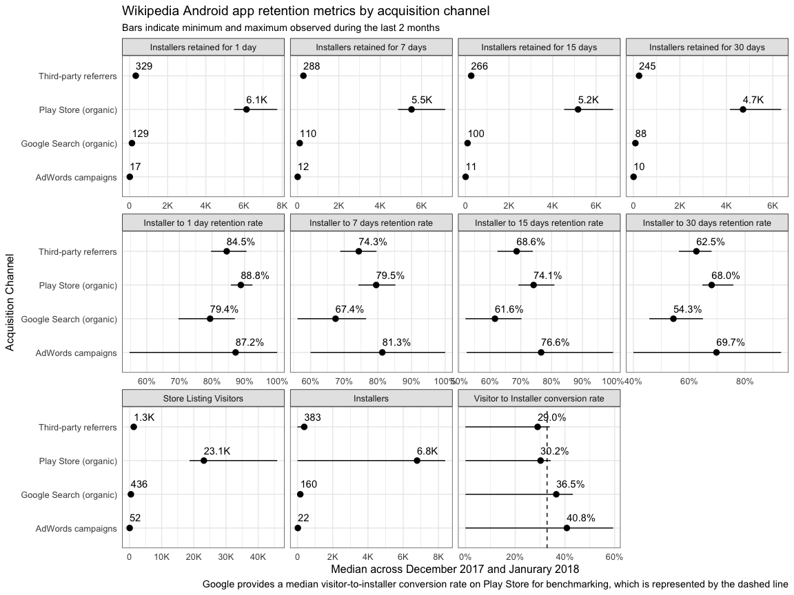
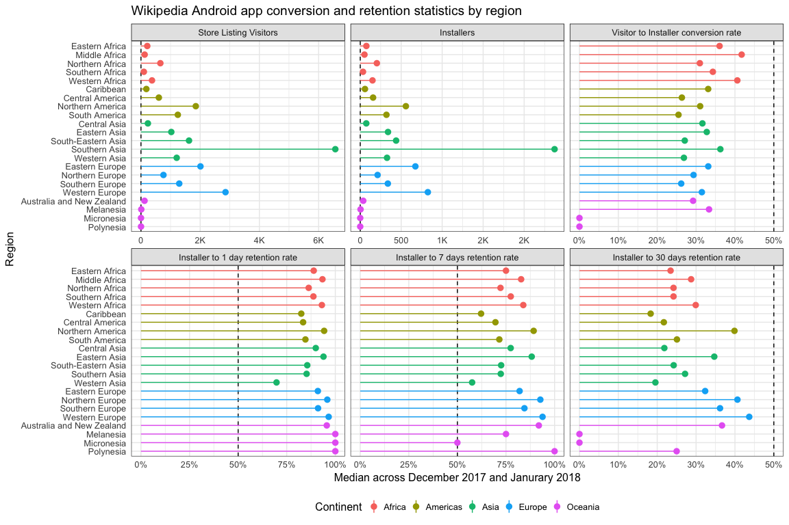
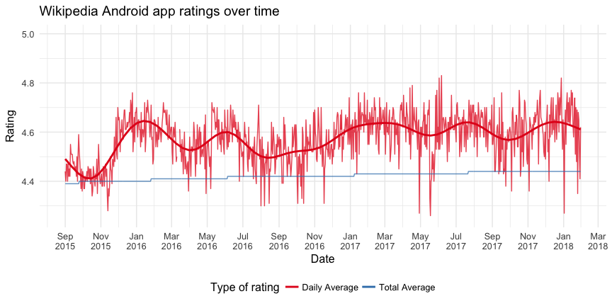
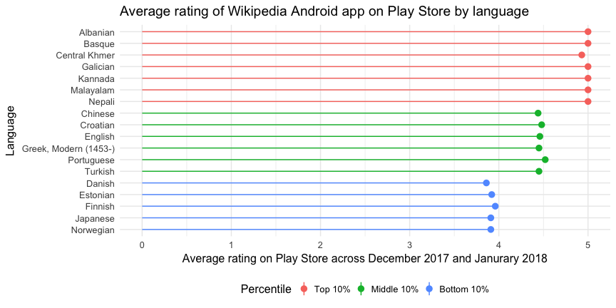
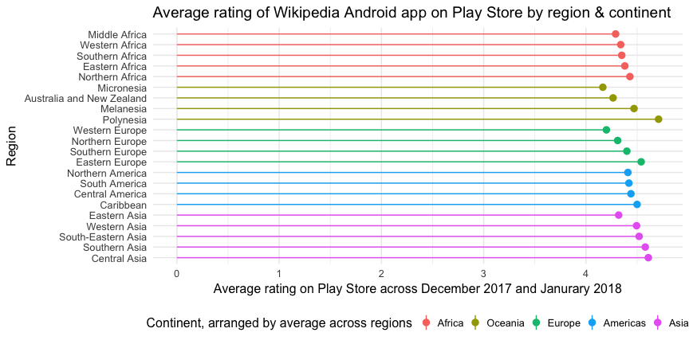
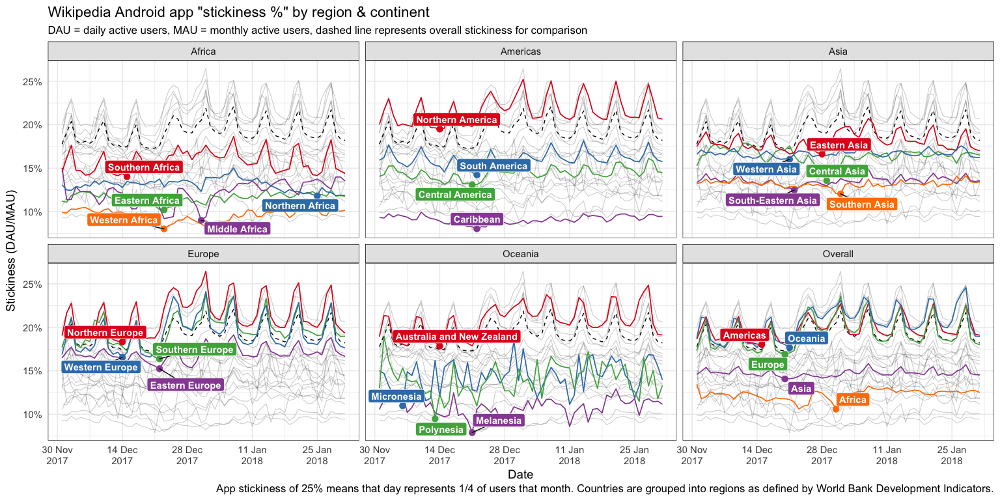

Understand Android app usage by market
================

This report for Phabricator ticket
[T184089](https://phabricator.wikimedia.org/T184089) was last generated
on February 14, 2018.

## Retained Installs

**Acquisition channels** in [acquisition
reports](https://play.google.com/apps/publish/?account=6169333749249604352#AcquisitionPerformancePlace:p=org.wikipedia&apr=RETAINED_INSTALLERS)
include Play Store (users find the app by browsing or searching on the
Play Store app), Google Search, third-party referrers (users find the
app via an untagged deep link to the Play Store), and AdWords (Google’s
advertising service).

<!-- -->

  - Very few people find the app via AdWords and fewer still actually
    install it and fewer still keep it installed for more than a day.
  - Users tend to find the app organically through the Play Store (and
    that’s *basically* it).
  - A little over a third of users who found the app via Google Search
    end up installing it.
  - Users who found the app via Play Store and AdWords campaigns and
    then installed it were more likely to keep the app installed for 30
    days than users who found it via Google search and other third-party
    referrers.
  - Compared to the median conversion and retention rates, the Wikipedia
    app is way better at 1/7/15/30-day install retention than other
    popular free apps in the *Books & Reference* category.

<!-- -->

  - The app’s Play Store page is not seen by many users in Africa, but
    the conversion rates for those regions are some of the highest rates
    compared to regions in other continents.
  - Way more people look at the app in the Play Store in Southern Asia
    than in any other region, but the conversion rate is close to the
    Play Store median.
  - Some of our lowest conversion rates are in Central America, South
    America, South-Eastern Asia, Western Asia, Southern Europe, and
    especially oceanic regions like Polynesia.
  - Even when users in those low-conversion regions do install the app,
    less than 30% of them keep the app installed more than 30 days.
  - 30-day retention rates are highest in North America, Europe in
    general, and Australia & New Zealand.

## Ratings

[App ratings over
time](https://play.google.com/apps/publish/?account=6169333749249604352#RatingsPlace:p=org.wikipedia)
are calculated from users’ 1-5 star ratings.

<!-- -->

<!-- -->

  - The languages whose users rated the app the lowest (e.g. Norwegian
    and Japanese) are still close to 4 stars on average.

**Note to self**: would be useful at some point to also compare by
families of languages, to see if we’re doing well/poorly in specific
families (e.g. Caucasian vs Asian vs Indo-European).

<!-- -->

  - The average rating is lowest in Africa across all regions.
  - Regions where the app is rated the lowest include:
      - Micronesia (e.g. Palau, Northern Mariana Islands, Federated
        States of Micronesia)
      - Western Europe (e.g. Belgium, France, Germany)
      - Eastern Asia (e.g. Japan, South Korea)
  - Regions where the app is rated the highest include:
      - Polynesia (Samoa, American Samoa, French Polynesia)
      - Eastern Europe (e.g. Belarus, Poland, Russia)
      - Central Asia (e.g. Kazakhstan, Tajikistan, Uzbekistan)
      - Southern Asia (e.g. India, Afghanistan, Pakistan)

## App Stickiness

<!-- -->

  - **Note**: refer to tables below for % of active users each continent
    and region was responsible for in January 2018
  - Overall stickiness is driven almost entirely by its stickiness in
    Europe (which was responsible for nearly half of all active users)
  - Highest stickiness is in Northern America and Europe in general
  - Lowest stickiness is in Africa (Western Africa countries
    specifically) and Southern/South-Eastern Asia
  - Other than Australia & New Zealand (where the app has high
    stickiness relative to other regions), the app is doing poorly in
    Oceanic countries (which had less than 1.5K users)

| Continent | Users in Jan ’18 | Share | Avg daily stickiness |
| :-------- | ---------------: | ----: | -------------------: |
| Africa    |          290.77K |  4.8% |                12.8% |
| Americas  |            1.42M | 23.4% |                22.3% |
| Asia      |            1.33M | 22.1% |                15.4% |
| Europe    |            2.91M | 48.1% |                20.6% |
| Oceania   |           96.59K |  1.6% |                22.9% |

| Continent | Region                    | Users in Jan ’18 | Share within continent | Avg daily stickiness |
| :-------- | :------------------------ | ---------------: | ---------------------: | -------------------: |
| Africa    | Eastern Africa            |           22.73K |                   7.8% |                12.2% |
| Africa    | Middle Africa             |           123.3K |                  42.4% |                12.9% |
| Africa    | Northern Africa           |           80.52K |                  27.7% |                13.3% |
| Africa    | Southern Africa           |           21.49K |                   7.4% |                16.6% |
| Africa    | Western Africa            |           42.73K |                  14.7% |                10.1% |
| Americas  | Caribbean                 |           55.72K |                   3.9% |                 9.7% |
| Americas  | Central America           |           85.43K |                   6.0% |                15.9% |
| Americas  | Northern America          |            1.09M |                  76.9% |                24.4% |
| Americas  | South America             |          186.03K |                  13.1% |                17.1% |
| Asia      | Central Asia              |           24.97K |                   1.9% |                16.7% |
| Asia      | Eastern Asia              |          296.12K |                  22.2% |                19.4% |
| Asia      | South-Eastern Asia        |          202.09K |                  15.2% |                14.3% |
| Asia      | Southern Asia             |          662.01K |                  49.6% |                13.4% |
| Asia      | Western Asia              |          148.68K |                  11.1% |                17.2% |
| Europe    | Eastern Europe            |          470.99K |                  16.2% |                18.0% |
| Europe    | Northern Europe           |          505.21K |                  17.4% |                23.3% |
| Europe    | Southern Europe           |           502.5K |                  17.3% |                20.9% |
| Europe    | Western Europe            |            1.43M |                  49.2% |                20.4% |
| Oceania   | Australia and New Zealand |           94.32K |                  97.7% |                23.1% |
| Oceania   | Melanesia                 |            1.49K |                   1.5% |                11.8% |
| Oceania   | Micronesia                |              441 |                   0.5% |                16.0% |
| Oceania   | Polynesia                 |              339 |                   0.4% |                16.3% |

## Sessions

Blockers:

  - \[ \] resolve sampling bug
    ([T186682](https://phabricator.wikimedia.org/T186682))
  - \[ \] resolve timestamp bug
    ([T186768](https://phabricator.wikimedia.org/T186768))

TODO:

  - \[ \] load
    [MobileWikiAppSessions](https://meta.wikimedia.org/wiki/Schema:MobileWikiAppSessions)
    events into Hadoop/Hive
  - \[ \] join with `wmf.webrequest` on `appInstallId` (found under the
    `wmfuuid` key in
    [X-Analytics](https://wikitech.wikimedia.org/wiki/X-Analytics))
  - \[ \] calculate summary metrics of session lengths by country
