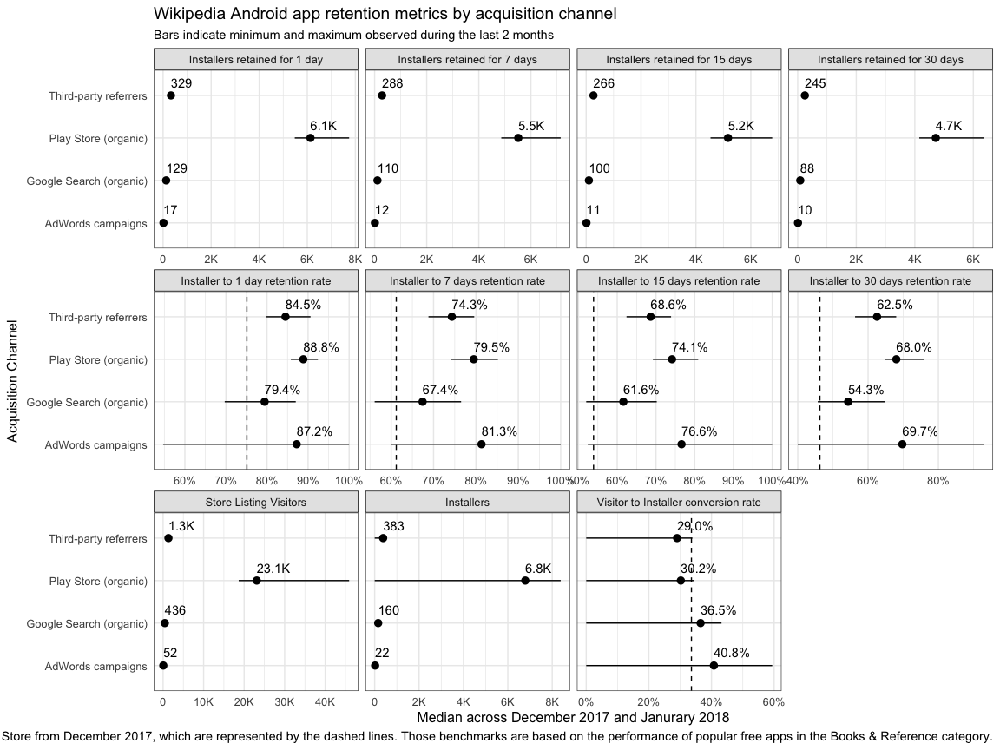

Understand Android app usage by market
================

This report for Phabricator ticket
[T184089](https://phabricator.wikimedia.org/T184089) was last generated
on February 01, 2018.

## Retained Installs

<!-- -->

  - Very few people find the app via AdWords and fewer still actually
    install it and fewer still keep it installed for more than a day.
  - Users tend to find the app organically through the Play Store (and
    that’s *basically* it).
  - We are very close to the median visit-to-install conversion rate
    across the whole Play Store.
  - A little over a third of users who found the app via Google Search
    end up installing it.
  - Users who found the app via Play Store and AdWords campaigns and
    then installed it were more likely to keep the app installed for 30
    days than users who found it via Google search and other third-party
    referrers.

<!-- -->

  - The app’s Play Store page is not seen by many users in Africa, but
    the conversion rates for those regions are some of the highest rates
    compared to regions in other continents.
  - Way more people look at the app in the Play Store in Southern Asia
    than in any other region, but the conversion rate is close to the
    Play Store median.
  - Some of our lowest conversion rates are in Central America, South
    America, South-Eastern Asia, Western Asia, Southern Europe, and
    especially oceanic regions like Polynesia.
  - Even when users in those low-conversion regions do install the app,
    less than 30% of them keep the app installed more than 30 days.
  - 30-day retention rates are highest in North America, Europe in
    general, and Australia & New Zealand.

## Ratings

<!-- -->

TODO: breakdown by country & language

## Sessions

TODO
